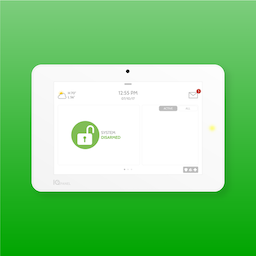

# ioBroker.qolsys

**Tests:** 

## qolsys adapter for ioBroker

This plugin only supports the IQ Panel basic security features:

| Feature                              | Status    |
|--------------------------------------|-----------|
| Arming partition (Arm-Away, Arm-Stay | Supported |
| Disarming partition                  | Supported |
| RF and wired sensor status           | Supported |

## Supported Qolsys Panels

| Panel                                       | Status    | Notes                                            |
|---------------------------------------------|-----------|--------------------------------------------------|
| [IQ2](https://qolsys.com/iq-panel-2/)       | Supported | Software >= 2.4.0                                |
| [IQ2+](https://qolsys.com/iq-panel-2-plus/) | Supported | For software >= 2.6.2: Enable 6-digit user codes |
| [IQ4](https://qolsys.com/iq-panel-4/)       | Supported | Software >= 4.1.0                                |

## Supported Sensors

| Sensor                      | Role                        |
|-----------------------------|-----------------------------|
| MOTION                      | sensor.motion               |
| OCCUPANCY_SENSOR            | sensor.motion               |
| PANEL_MOTION                | sensor.motion               |
| BREAKAGE                    | sensor.noise                |
| GLASSBREAK                  | sensor.noise                |
| PANEL_GLASS_BREAK           | sensor.noise                |
| SHOCK                       | sensor.noise                |
| SHOCK_OTHERS                | sensor.noise                |
| SHOCK_SENSOR_MULTI_FUNCTION | sensor.noise                |
| SMOKE_HEAT                  | sensor.alarm.fire           |
| SMOKE_MULTI_FUNCTION        | sensor.alarm.fire           |
| CONTACT                     | sensor.contact.window\|door |
| CONTACT_MULTI_FUNCTION      | sensor.contact.window\|door |
| TAKEOVER_MODULE             | sensor.contact.window\|door |
| WIRED_SENSOR                | sensor.contact.window\|door |
| WATER                       | sensor.alarm.flood          |
| WATER_IQ_FLOOD              | sensor.alarm.flood          |
| WATER_OTHER_FLOOD           | sensor.alarm.flood          |
| CARBON_MONOXIDE             | sensor.alarm                |
| FREEZE                      | sensor.alarm                |
| RF_KEYPAD                   | sensor.alarm                |
| TEMPERATURE                 | sensor.alarm                |
| TEMPERATURE_MULTI_FUNCTION  | sensor.alarm                |

## Qolsys Panel Configuration

**Note**: Enabling C4 integration will force the use of 6 digit codes!
Existing codes will have 00 appended to them.

### IQ2, IQ2+ and IQ4

1. Start by enabling Control 4 integration on Qolsys panel:
    1. Settings
    2. Advanced Settings
    3. Enter Dealer Code (defaults to 2222 or 222200)
    4. Installation
    5. Devices
    6. WIFI Devices
    7. 3rd Party Connections
    8. Check the Control4 box
    9. Reboot Qolsys Panel

2. Reveal Secure Access Token:
    1. Settings
    2. Advanced Settings
    3. Enter Dealer Code (defaults to 2222)
    4. Installation
    5. Devices
    6. WIFI Devices
    7. 3rd Party Connections
    8. Select Reveal Secure Token field

## Credits

- [Home Assistant support thread](https://community.home-assistant.io/t/qolsys-iq-panel-2-and-3rd-party-integration/231405)
- [Homebridge Qolsys IQ Panel plugin (EHylands)](https://github.com/EHylands/homebridge-qolsys)
- [Hubitat QolSysIQPanel plugin (dcaton)](https://github.com/dcaton/Hubitat/tree/main/QolSysIQPanel)

## Changelog

### **WORK IN PROGRESS**

### 0.0.2-alpha.0 (2023-06-24)

* Testing

### 0.0.1 (2023-24-5)

* Initial development

## License

MIT License

Copyright (c) 2023 Jonathan Bradshaw <jb@nrgup.net>

Permission is hereby granted, free of charge, to any person obtaining a copy
of this software and associated documentation files (the "Software"), to deal
in the Software without restriction, including without limitation the rights
to use, copy, modify, merge, publish, distribute, sublicense, and/or sell
copies of the Software, and to permit persons to whom the Software is
furnished to do so, subject to the following conditions:

The above copyright notice and this permission notice shall be included in all
copies or substantial portions of the Software.

THE SOFTWARE IS PROVIDED "AS IS", WITHOUT WARRANTY OF ANY KIND, EXPRESS OR
IMPLIED, INCLUDING BUT NOT LIMITED TO THE WARRANTIES OF MERCHANTABILITY,
FITNESS FOR A PARTICULAR PURPOSE AND NONINFRINGEMENT. IN NO EVENT SHALL THE
AUTHORS OR COPYRIGHT HOLDERS BE LIABLE FOR ANY CLAIM, DAMAGES OR OTHER
LIABILITY, WHETHER IN AN ACTION OF CONTRACT, TORT OR OTHERWISE, ARISING FROM,
OUT OF OR IN CONNECTION WITH THE SOFTWARE OR THE USE OR OTHER DEALINGS IN THE
SOFTWARE.
